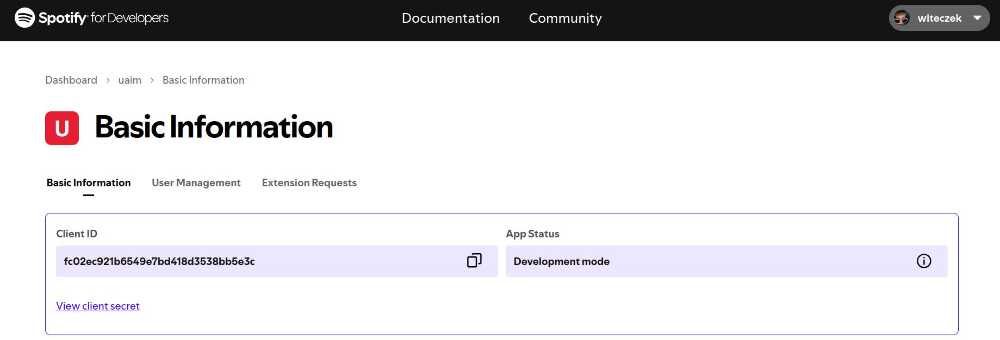
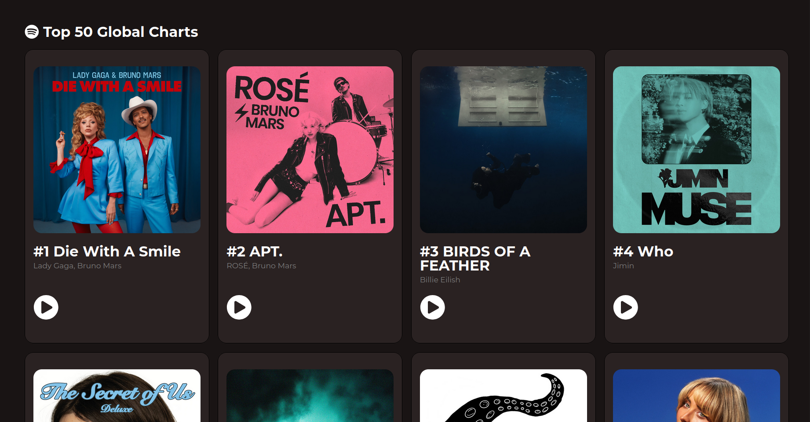
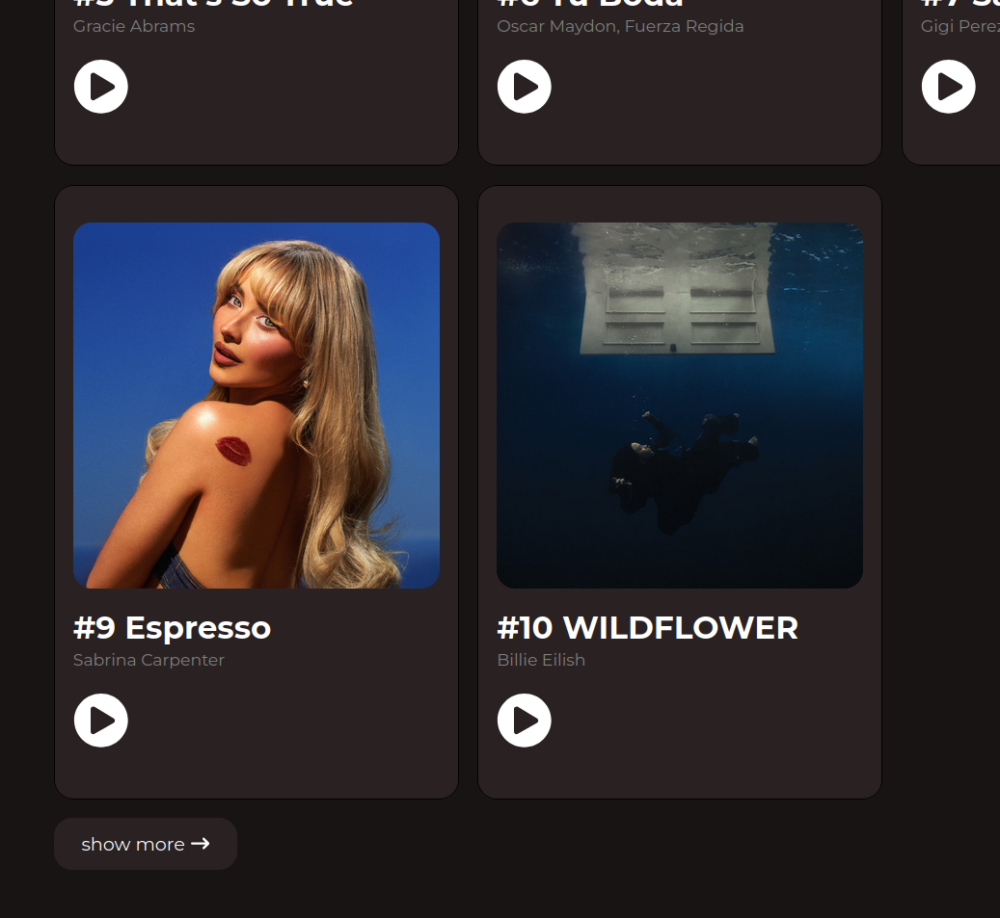
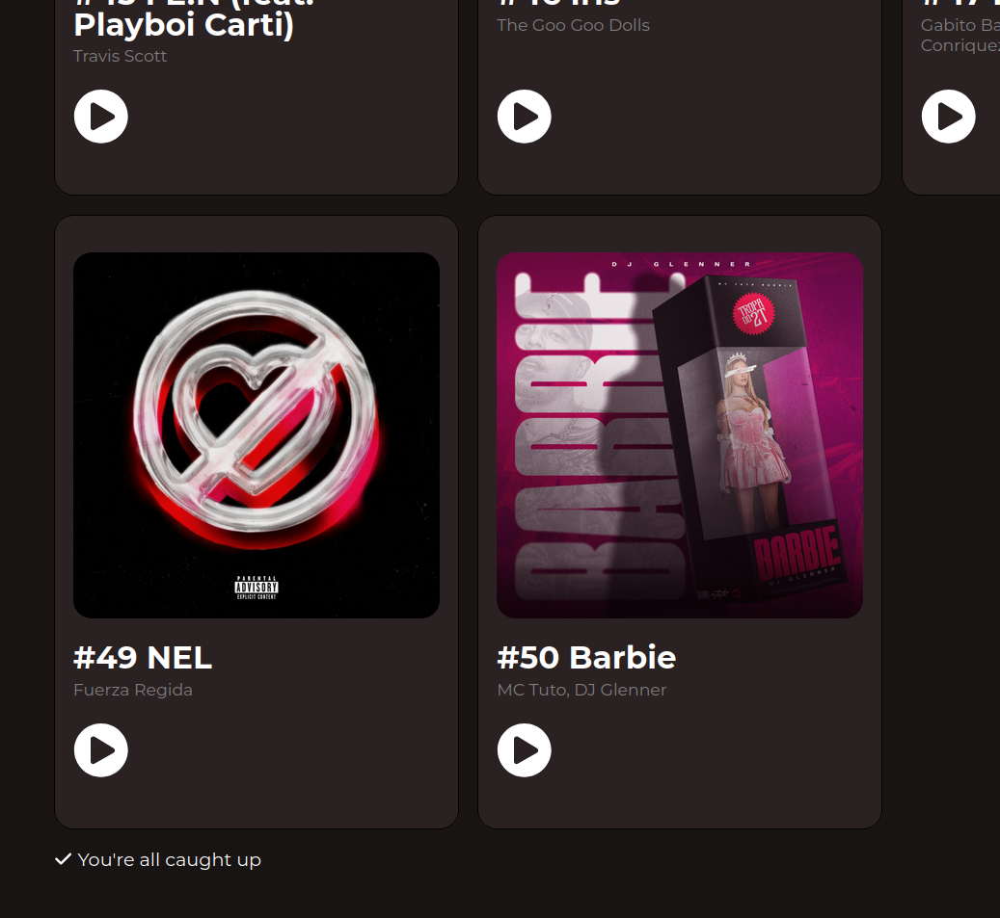
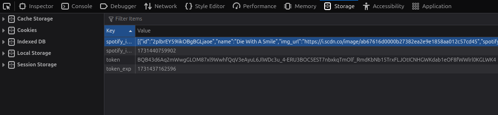
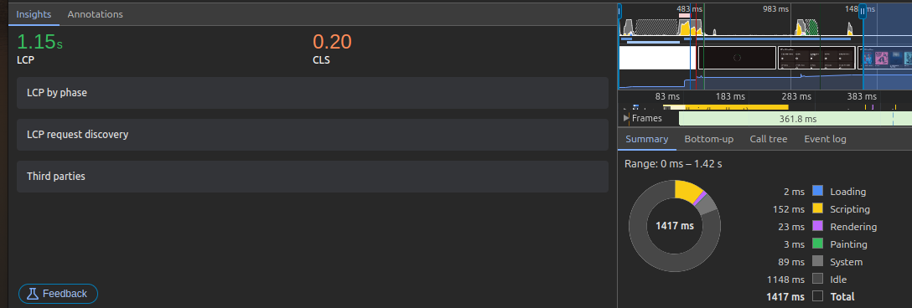

# UAIM
**author: Wiktor Zawadzki**

# Getting Started 
### Run below commands to start on your local machine

1. `git clone https://github.com/wiktoz/lab2.git`

2. `cd lab2`

3. `npm install`

4. `npm start`

# App Description
Application is presenting Top 50 Global Listened Songs. Data is fetched from Spotify.

API url: [http://api.spotify.com](http://api.spotify.com)

DOCS url: [http://developer.spotify.com](http://developer.spotify.com)

In order to get access to the Spotify API we need to create account and get `client_id` and `client_secret`.

First action we need to perform to get access to the API is to send request to the `https://accounts.spotify.com/api/token` endpoint including `client_id` and `client_secret`. When credentials are correct we should obtain `access token` in response. From now we will include it in headers as `Authorization` header for every request we will make in the future.

In localStorage we also save token expiration time and re-fetch token automatically when it is expired.

When we have a token we make request to fetch `Top 50 Global Charts` songs. The dataset is abundant therefore we remove unnecessary fields and save everything in localStorage. Songs can change their position in ranking for that reason I decided to include field containing `time to next fetch` (by default one hour).

Unfortunately Spotify does not provide option to fetch data in batches (e.g. using `offset` and `skip`) so I download whole dataset and render in React only 10 songs. Later on user can click `show more` to print more data. Many photos on the website has a huge impact on Largest Contentful Paint (LCP).

### App View

### Show More

### Information we expanded all possible songs

### Data fetched from Spotify is reduced to the necessary fields and saved in localStorage. Moreover, there is a mechanism implemented to re-fetch data from Spotify to the localStorage every hour (by default - we can change that value).

### 

First fetch - data from the API

Second fetch - data from localStorage. We got lower LCP time by a half.
